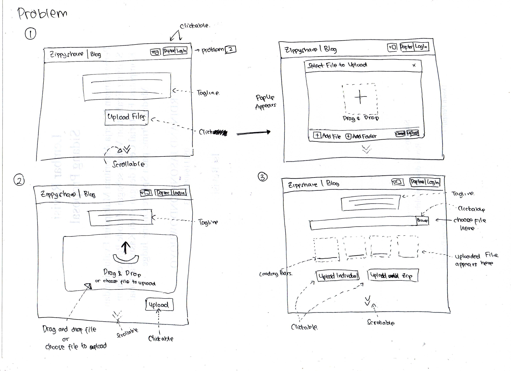
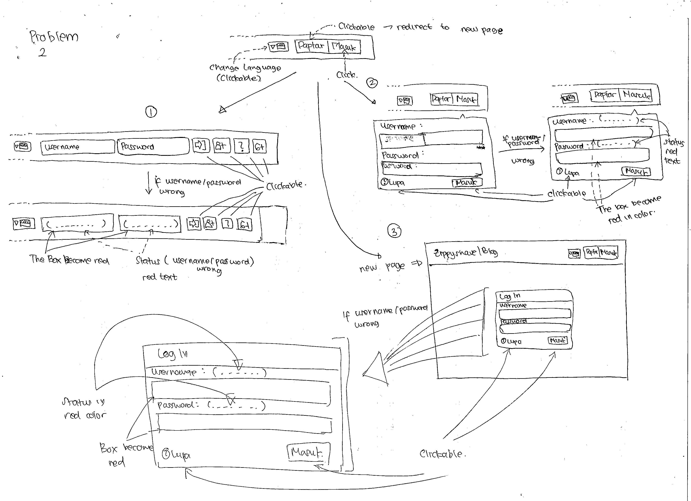
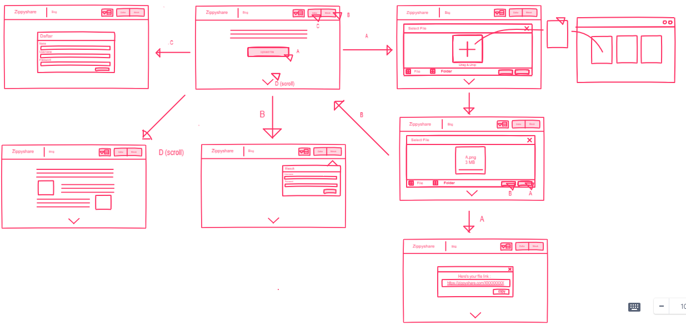

# Sketching and Prototyping for Zippyshare
Using the information in the results of Assignment 1 for what is good and bad about the UI for designed tasks, we are going to make **Sketches** and **Prototypes**. These sketches and prototypes will lead to better design in Assignment 3. The prototypes will be then tested through a usability evaluation followed by design revision in Assignment 4.

## Outline
- [Sketching and Prototyping for Zippyshare](#sketching-and-prototyping-for-zippyshare)
  - [Outline](#outline)
  - [Part A: Sketches](#part-a-sketches)
    - [1. Scan/Photo of Sketches](#1-scanphoto-of-sketches)
      - [1.1. Solution Problem 1](#11-solution-problem-1)
      - [1.2. Solution Problem 2](#12-solution-problem-2)
    - [2. Version Differences](#2-version-differences)
      - [2.1. Solution Problem 1](#21-solution-problem-1)
        - [Problem](#problem)
        - [Solution 1](#solution-1)
        - [Solution 2](#solution-2)
        - [Solution 3](#solution-3)
      - [2.2. Solution Problem 2](#22-solution-problem-2)
        - [Problem](#problem-1)
        - [Solution 1](#solution-1-1)
        - [Solution 2](#solution-2-1)
        - [Solution 3](#solution-3-1)
    - [3. Selected Sketch](#3-selected-sketch)
      - [Problem 1](#problem-1)
      - [Problem 2](#problem-2)
    - [4. Design Rationale](#4-design-rationale)
  - [Part B: Assumptions](#part-b-assumptions)
    - [1. Hardware](#1-hardware)
    - [2. Users](#2-users)
  - [Part C: Prototypes](#part-c-prototypes)
    - [Low Fidelity](#low-fidelity)
    - [High Fidelity](#high-fidelity)

## Part A: Sketches
Sketch at least **3 (three)** different UIs for the functions you are targeting. These three interfaces should be _dramatically different_ in terms of design directions. For example, they can be with different organizations of what functions on each screen or using a different layout of the icons, widgets, and menus on the screens. If you want, you can also incorporate non-on-screen UIs: physical buttons, gestures through motion sensors, etc.

You need **not** sketch the whole interface. It is not necessary for the sketches to have every function or every function in detail, but there should be enough to show off your general idea. **Be creative!** Draw your idea and label a few of the widgets so we can tell your intent. The goal is to have at least 3 good UIs in *interesting* ways. Sketches should be done on paper with  pens and/or pencils (do not use a computer).

### 1. Scan/Photo of Sketches
#### 1.1. Solution Problem 1

#### 1.2. Solution Problem 2

### 2. Version Differences
#### 2.1. Solution Problem 1
##### Problem
- User are confused in uploading files to zippyshare
- Many button unclickable
- Many unfunctional menu
##### Solution 1
- Make a huge button `Upload Files`, which trigger the pop-up to uploading files
- Make with Drag and Drop feature and browse file.
##### Solution 2
- No pop-up, just huge Drag and Drop Box.

##### Solution 3
- Do not using pop-up or drag and drop feature, use browse file from explorer to upload, maybe some people don't like the drag and drop box.
- Last, we need to spesify to upload as individual file or zip file first and upload it.

#### 2.2. Solution Problem 2
##### Problem
- Red color in field, make hard to read the username and user's input
- Sign Up menu only avaiable in homepage
##### Solution 1
- Make inline login, register, forgot password feature after clicking `Login` button
- If username / password inputed by user is wrong, show red box in field and status text
##### Solution 2
- Alternate from solution 1, make `Login` button as trigger the pop-up Login Form.
- If username / password inputed by user is wrong, show red box in field and status text
##### Solution 3
- Alternate from solution 1 and 2, make `Login` butoon as trigger to redirect to new page.
- If username / password inputed by user is wrong, show red box in field and status text

### 3. Selected Sketch
#### Problem 1
- For the problem 1, the writer choose the solution 1, because more simple and having complete feature.
- Solution 1 is more affordable to user for using it.
#### Problem 2
- For the problem 2, the writer choose the solution 2, because is more lightweight compared to solution 3, because reduce request to server.
- Compared to solution 1, solution 1 need to having thick menubar. For small screen, maybe unresponsive.

### 4. Design Rationale
The sketch and it's selection are made by designer considering perspective from non tech-savy. By using this method, we'll know what's wrong with the interface and what should we do to make it better. From Contextual Inquiry user said that she need design that can intuitively describe it's purpose, so I proposed this design.

## Part B: Assumptions
### 1. Hardware
1. Screen size : 15.6 inch
2. Screen resolution : higher than or equal tp 1366 x 768 with ratio 4:3 with color
3. Computer with minimum requirement :
   - Intel Dual-Core
   - Intel HD Graphic
   - 2 GB RAM
4. Using physical buttons (mouse) or touch screen

### 2. Users
1. Familiar using web browser.
2. User have medium experience on it.
3. User age range from 8-60 years old.

## Part C: Prototypes
### Low Fidelity

### High Fidelity
Prototype can be accesed with https://invis.io/8XR80O32YHF (Revision)
